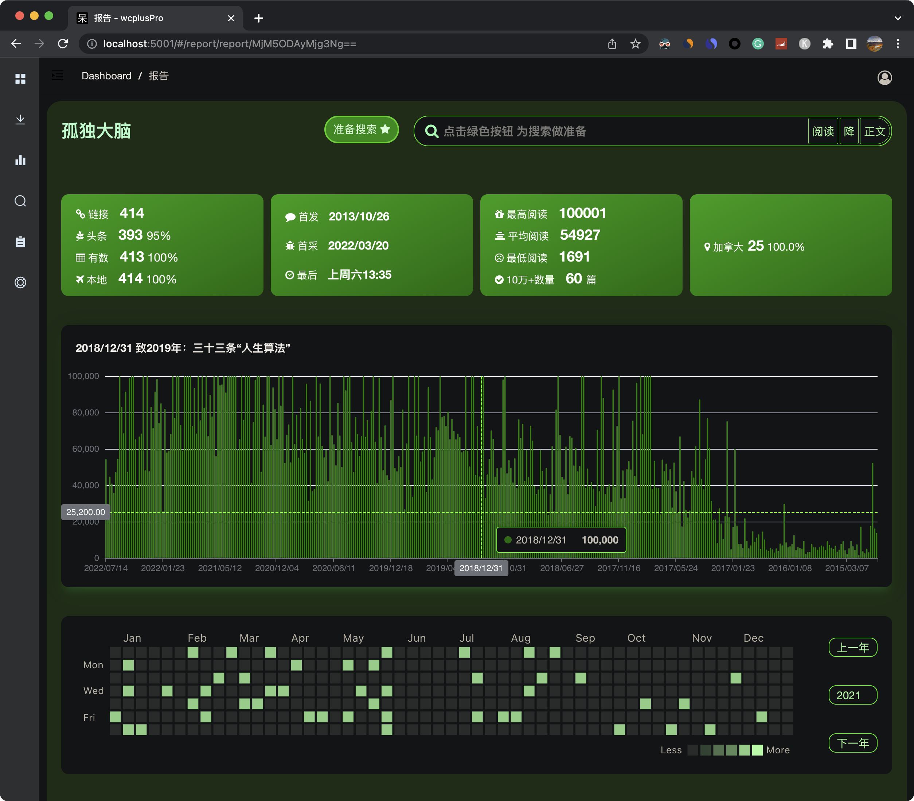

Github主页 | [官网](https://www.wcplus.cn/pro?s=weixin_crawler) | [4K视频介绍](https://www.youtube.com/watch?v=nAtqSTgVRw0) | [完整用户界面展示.pdf](https://www.wcplus.cn/static/file/ui.pdf) | [源代码结构](struct.md) 

     

 

 

weixin_crawler 已于2019年更名为 wcplusPro，不再免费提供源代码。更名之前的最新的源代码（最后更新于2019年3月），仍然开源，位于项目的 weixin_crawler/ 路径下，可能已经无法直接运行，仅供学习之用，使用方法见[文档](http://www.wcplus.cn/weixin_crawler?s=weixin_crawler)。本文仅介绍 wcplusPro 的技术和功能特性。

wcplusPro 提供了：
- 稳定的公众号数据采集服务
- 面向公众号的分析报告
- 公众号全文检索

你可以按照使用时长购买订阅版，也可以直接购买源代码。如果不确 wcplusPro 是否满足需求，请在官网首页申请试用。

- [官网](https://www.wcplus.cn/pro?s=weixin_crawler)
- [详细功能介绍](https://www.wcplus.cn/intro?s=weixin_crawler)
- [产品形式](https://www.wcplus.cn/product?s=weixin_crawler)
- [在线演示](https://www.wcplus.cn/demo?s=weixin_crawler)
- [视频演示](https://www.youtube.com/watch?v=nAtqSTgVRw0)

### 功能特性

1. 采集任意公众号的全部历史文章数据，这些数据包括：
   - 公众号的名称
   - 标题、封面链接、作者、摘要、发布时间（精确到秒）、版权标志、发文IP属地
   - 文章位置（头条、次1条等）
   - 永久文章链接
   - 图文内容（包括文章开头的原创标识和文末的原文链接，用户可进一步提取图文中的文字和图片）
   - 阅读数量、点赞数量、在看数量、评论数量、打赏数量 在内的数据。
2. 提供面向公众号的分析报告 
   - 阅读数据全景图，包括阅读量、点赞量、阅读量、赞赏量、在看量、评论量
   - 全部历史文章列表，可以筛选、排序
   - 数据报告卡片：文章数据报告卡片、时间数据报告卡片、影响力数据报告卡片、发文IP属地数据报告卡片
   - 发文周历统计报告
3. 公众号全文检索
   - 所有已经采集公众号的标题、作者、摘要全文检索
   - 单个公众号的标题、作者、摘要、正文全文检索

详细功能介绍请查看[官网文档](https://www.wcplus.cn/pro?s=weixin_crawler)

### 技术特性

- 自带安装脚本、运行脚本，点击鼠标就能完成所有的安装和运行工作，零技术要求。
- 提供详细在线使用文档、QA手册。
- 前后端分离，使用 socketio 做前后端实时通信

#### 前端
  
- 前端框架 vue2，打包 webpack
- 图表 ECharts
- 部分 UI 组件 Element
- http 请求 axios
- 图标 Font Awesome

#### 后端

- 经典 MVC 架构
- 纯 Python 编写，支持 Python3.7 及其更高版本
- web 框架 tornado
- 异步网络请求 tornado
- 数据库 sqlite
- 爬虫加速 Python 协程
- 前后端实时通信 socketio

### 申请试用
试用版，足够完成对1个公众号，全部历史文章的采集。无论是几十篇文，还是数万篇文章
[wcplusPro试用版 申请方法](https://www.wcplus.cn/intro/a/2.html)

### 版本更新

##### 8.02 / 2022年12月24日 订阅版
- 优化macos下安装脚本，安装运行wcplusPro更简单

##### 8.01 / 2022年12月05日 订阅版
- 在帮助页面可以直接下载最新版本的wcplusPro，更新软件更简单

##### 8.0 / 2022年11月25日 订阅版
- 支持通过点击文章链接获取所有参数，无需再点击 qq.com，参数获取速度更快
- 帮助页面可直接看到 IP 地址，简化代理设置过程
- 增加手机远程通知，可第一时间了解任务进度和状态

##### 7.57 / 2022年11月18日
- macOS 下支持通过桌面版微信获取参数（Beta）
- 支持自动代理模式，简化获取参数前的代理设置工作

##### 7.56 / 2022年10月31日
- 导出的 CSV 文件增加原文 html 文件名，方便找到原文

##### 7.55 / 2022年10月26日
- 左边菜单栏更改为默认不显示，通过左上角按钮可弹出菜单。增加了屏幕利用率的同时，也让界面更加简洁
- 去除了所有表格的边框

##### 7.54 / 2022年10月16日
- 对已采集的数据 增加百分比显示 每个公众号的数据状态一目了然
- 百分比搭配进度条、颜色标签 更加直观展示数据状态
- 重新设计了多彩文章列表UI

##### 7.53 / 2022年10月13日
- 修复已知的UI逻辑错误

##### 7.52 / 2022年9月6日
- 新增导出 Excel 完成后 自动打开导出的文件
- 修复 Windows 下直接使用 Excel 查看导出文件乱码的问题

##### 7.51 / 2022年8月20日
- 搜索结果增加文章封面显示
- 修复全文检索遇到无发文日期文章时，无法显示搜索结果的错误

##### 7.5 / 2022年7月25日
- 新增公众号报告全文精确检索
- 新增公众号报告统计数据卡片，统计数量、时间、影响力、发文地区信息
- 优化公众号报告文周历
- 优化UI视觉

##### 7.43 / 2022年7月15日
- 新增复制微信历史文章主页链接到剪切板

##### 7.42 / 2022年7月2日
- 修复按时段区间采集阅读数据的bug
- 修复微信读书参数背景颜色显示的错误

##### 7.41 / 2022年6月9日
- 源码版支持 Python3.7.7 及更高版本，更低版本未做严格测试

##### 7.4 / 2022年6月8日
- 新增订阅版，可按时长购买 wcplusPro

##### 7.31 / 2022年6月3日
- 修复搜集文章内容偶尔提示 Netowrk error 的 bug

##### 7.3 / 2022年5月31日
- 新增搜集发文地区, 可在全部历史文章列表日期和地区栏查看

##### 7.2 / 2022年4月17日
- 新增历史任务日历热点图
- 阅读数据全景图增加在看数据
- 公众号报告增加发文日历热点图

##### 7.1 / 2022年4月13日
- 新增搜索功能，可按照标题、摘要、作者 关键词精确搜索
- 新增搜索结果多种排序方式
- 新增搜索结果月份指数

##### 7.05 / 2022年4月4日
- 添加导出到 Excel 的功能
- 修复运行 windows_install_package.bat 闪退的 bug
- 修复搜集阅读量为 0 文章的阅读数据时，提示 out of date 的错误

##### 7.04 / 2022年3月27日
- 增加更新检查功能

##### 7.03 / 2022年3月25日
- 修复已知 bug

##### 7.02 / 2022年3月24日
- 修复 windows 下保存文章原文失败的错误

##### 7.01 / 2022年3月22日
- 简化安装和使用步骤，双击鼠标即可完成所有工作
- 增加 window 系统双击安装Python依赖脚本
- 增加 window 系统双击安装运行wcplusPro脚本
- 增加 macos 双击安装Python依赖脚本
- 增加 macos 双击安装运行wcplusPro脚本

##### 7.0 / 2022年3月21日
- 使用协程重写了全部后端，所有网络请求均为异步模式，增强了代码可维护性，二次开发成本更低
- 数据库从 mysql 改为 sqlite，使用无需单独运行数据库，降低了对系统资源的占用
- 重新设计了任务板块 UI，创建任务、任务状态、任务进度、参数、历史任务一目了然
- 增加数据搜集过程实时推送用户界面的功能，无需要在终端观察任务进度
- 增加历史任务管理功能，完整记录所有的历史任务
- 优化了公众历史文章列表，浏览文章数量超过 5000 的公众号更加流畅
- 增加了配套网站 wcplus.cn 提供在线文档在内的多种功能
- 增加检查更新功能

##### 6.62 / 2022年2月25日
- 公众号报告增加所有阅读量10万+文章专栏
- 增加文章 在看/点赞比、赞赏/在看比

##### 6.61 / 2022年2月20日
- 修复已知 bug

##### 6.6 / 2022年2月19日
- 新增公众号报告 统计阅读量、点赞、在看数据历史变化趋势
- 升级前端工程 运行前端项目更加简单
- 修复无法通过 qq.com 跳转到公众号主页的错误
- 新增管理登陆功能

##### 6.31 / 2022年1月7日
- 修改代理服务器仅对微信和微信读书有效
- 移除代理服务器无关日志信息

##### 6.3 / 2021年11月10日
- 修复macOS Monterey 隔空播放占用 5000 端口的冲突

##### 6.23 / 2021年10月20日
- 修复已知 bug

##### 6.22 / 2021年9月20日
- 修复通过微信读书采集阅读数据提示 keyError subscene 的错误
- 修复其他已知 bug

### 联系购买

邮箱: <a href = "mailto:wonderfulsuccess@163.com">wonderfulsuccess@163.com</a> 点击邮箱地址可直接发送邮件

微信: wonderfulcorporation，也可以通过扫码添加客服（请备注 wcplusPro）

