Github主页 | [官网](http://www.wcplus.cn/?s=weixin_crawler)|[视频介绍](https://www.bilibili.com/video/BV1Ji4y1S7Xy)

 

 

极致性价比的微信公众号数据分析软件 好学、好用、好定制

Hi 由于架构原因，我们重新设计了 weixin_crawler 并更名为 wcplusPro，并且不再开源。wcplusPro 是一个款产品级微信公众号数据分析软件，在 weixin_crawler 的基础上，经过 4 年持续迭代，架构精简、稳定成熟、开箱即用、界面优雅。

## 🎉 致力于

wcplusPro 致力于帮助你从微信公众号中获得洞见，背后的原理并不复杂：

- 👏 首先，wcplusPro 提供稳定的公众号数据搜集服务，帮助你拿到任何公众号的全部历史文章数据，包括阅读数据。
- 🚀 其次，以公众号为单位，wcplusPro 提供多种上帝视角图表报告和精确搜索服务，你甚至可以导出数据。
- 🐎 最后，wcplusPro 针对桌面电脑优化，充分利用大屏幕，高密度陈列信息。一台电脑运行 wcplusPro，局域网内的所有设备都能使用。

## 🎉 技术特性

- 💪 前后端分离，前端使用 Vue+Webpack，后端使用 Python，支持3.6+。既能充分利用前端工程构建优雅的用户界面，又能利用 Python 的完整生态，高效开发。
- 💅 同时使用 RESTful API 和 socketio 进行前后端通信，Python 可主动推送消息给前端，用户体验媲美原生桌面应用
- 🌍 Web 框架使用 tornado，同时爬虫异步网络请求也是 tornado。尽可能减少项目依赖，给学习研究提供便利
- 👏 使用 Python 协程提高采集速度，采集速度快，占用系统资源少
- 😈 注释丰富，核心代码仅千余行
- 🥳 使用轻量级数据库 sqlite，得益于 Python 对 sqlite 的原生支持，可免安装直接运行。尽管如此，仍然可以高效存取百万数量级文章
- 🚀 跨平台支持 windows、macOS、Linux(包括树莓派)
- 📦️ 提供一键安装脚本、一键运行脚本，0 技术门槛
- 🪐 详细功能介绍见底部详细内容或者[wcplusPro官网](http://www.wcplus.cn/?s=weixin_crawler)

## 🚗 功能特性

可搜集任意公众号的全部历史发文数据。包括：
1. 🔫 所属公众号
2. 🚢 标题、作者、摘要、发布时间（精确到秒）、文章位置（头条、次1条等）、封面链接、原创标志、永久文章链接
3. 🌞 图文内容（包括于开头的原创标识和文末的原文链接，用户可进一步提取图文中的文字和图片）、发文国家和地区
4. 📖 阅读量、点赞量、在看量、评论量、打赏量

提供公众号数据的重新展示、排列、筛选。让用户针对公众号进行主题阅读时，可快速穿梭于不同的公众号、文章之间，提升数倍效率的同时，让获得洞见的几率大幅度提高
1. 👍 提供 “所有已经搜集到的公众号” 统计表，每一行直接显示公众号的昵称、文章总数、有阅读数据的文章总数、头条文章数、原文保存在本地的文章数、首次搜集时间、最近搜集时间
2. 💗 提供 “公众号的全部文章” 统计表，每一行直接显示文章的发文日期和地区（精确到分钟）、阅读量、在看量、评论量、文章位置、作者、标题
3. 🗺️ 提供 “可交互式阅读数据全景图”
4. 👩‍⚕️ 提供 “公众号诊断报告”
5. 🔍 提供 “精确搜索”
6.  🚪 提供 “数据导出”

功能特性详细介绍见下文

## 🌐 官网

产品形式上，wcplusPro 提供了源码版和订阅版，既能满足研究学习，又适合仅仅采集数据的情况，详见[产品和交付](http://www.wcplus.cn/product?s=weixin_crawler)

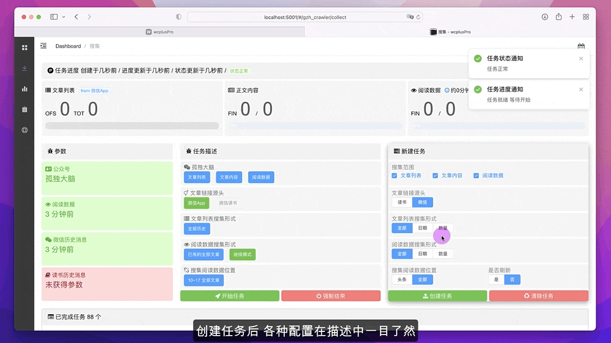
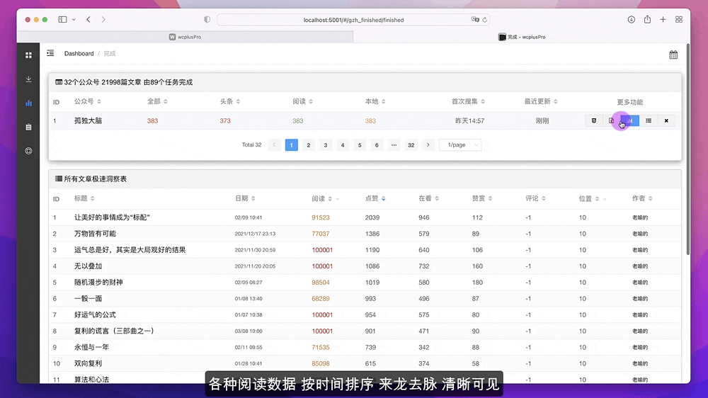

更多技术介绍请访问官网 [wcplusPro官网](http://www.wcplus.cn/?s=weixin_crawler) ，你也可以继续阅读下文，了解详细功能。

## 🧾 功能介绍

除了阅读文章，你还可以直接看视频介绍，或者查看在线演示

- 本文为图文介绍，如果你想通过4分钟的视频快速了解，请观看 [视频介绍](https://www.bilibili.com/video/BV12P4y1T7CJ)
- 同时我们准备了长达 10 分钟的[视频解说](https://www.bilibili.com/video/BV1Ji4y1S7Xy)
- [在线演示](http://www.wcplus.cn/demo?s=weixin_crawler)体验 wcplusPro 提供的部分功能，鉴于 wcplusPro 是专为大尺寸屏幕设计的高效公众号数据分析软件，建议使用电脑等宽屏设备查看在线演示  。

### wcplusPro

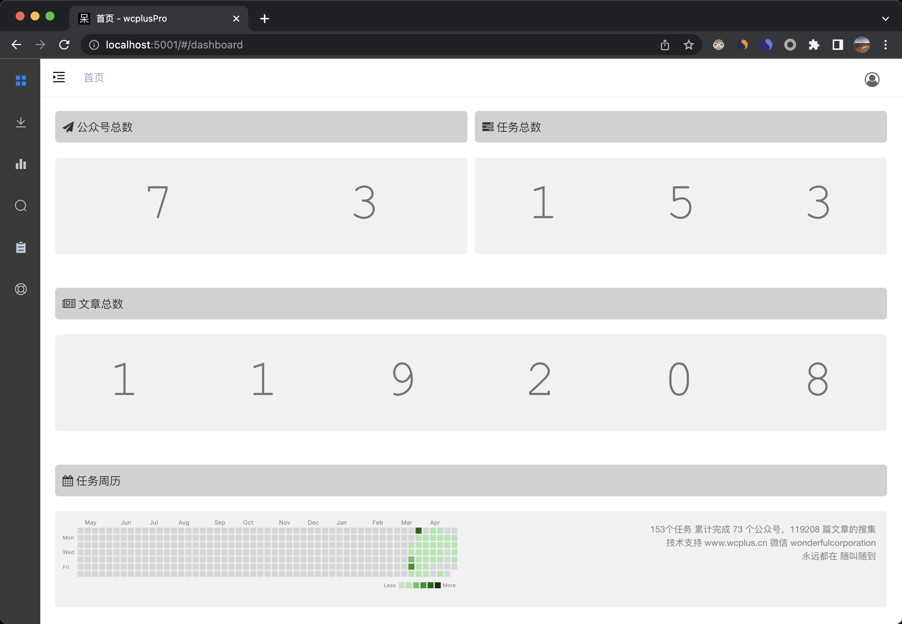

当你打开 wcplusPro，在启动页赫然显示着两个硕大的数字

- 左上角的数字，表示系统中有 73 个微信公众号；
- 右上角的数字，表示该用户创建了 153 个数据采集任务；通过下方的任务周历，可以清晰看到任务创建的日期、星期和当日相对数量；
- 下面的数字，表示系统中有 11万9千多篇文章；

尽管多达 10 万篇文章， wcplusPro 依然将所有的数据管理得井井有条。用起来起来健步如飞，长期后台运行也不会导致电脑发热、卡顿。

对于绝大多数人而言，不管是出于何种目的，一一研究 100 个公众号的 10 万篇文章，应该是一个绰绰有余的上限，虽然  wcplusPro 搜集公众号数据的能力不止于此。

你可能想问，wcplusPro 具体能搜集到关于公众号的哪些数据？提供了什么样的工具帮助用户使用这些数据？

### 第一 搜集数据

#### 1 可搜集内容

任意一个公众号发布的每一篇文章，wcplusPro 都能做到自动保存。对于那些已经被删除或屏蔽的文章，也就是手机微信也无法查看的文章，wcplusPro 自然也无能为力。另外，对于已经注销的公众号，也无法搜集其文章数据。

具体到一篇文章上，wcplusPro 能搜集的数据包括：

1. 所属公众号
2. 标题
3. 作者
4. 摘要
5. 发布时间（精确到秒）
6. 文章位置（头条、次1条等）
7. 永久文章链接
8. 图文内容（包括于开头的原创标识和文末的原文链接，用户可进一步提取图文中的文字和图片）
9. 阅读量、点赞量、在看量、评论量、打赏量

在内的数据。

#### 2 效率

在上述 9 条可搜集数据中，前 8 条相对较快， 可达到 15篇文章/秒 的速度。第 9 条数据单独搜集，速度为 1篇文章/3秒。

举个例子，对于一个历史发文 3000 篇的公众号，完成前 8 类数据的搜集需要  7 分钟。继续完成第 9 类数据的搜集需要额外  150 分钟，如果只要头条文章的阅读数据，时间可缩短至 30 分钟左右。

从我们的经验来看，除了资讯类大号，发文总数超过 3000 篇的高质量公众号并不多。绝大多数情况下，30 分钟左右即可完成对一个公众号全部数据的搜集。如果排除第 9 类数据，时间可缩短至 5 分钟。

#### 3 搜集任务管理

一个任务描述了要搜集一个公众号的哪些数据，比如是否需要阅读量，是否需要文章内容。

在 wcplusPro 中，任务进度实时推送到用户界面，搜集了多少、还剩多少、剩余时间估算，一目了然。

另外，wcplusPro 的用户界面是通过浏览器呈现，一旦 wcplusPro 运行在了一台电脑上，同一个网络下的其他设备（包括手机和平板）或者用户都能使用，类似共享的打印机。下图是 wcplusPro 在移动端的 UI。

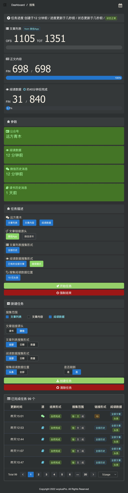

### 第二 洞察数据

wcplusPro 的价值在于对于公众号数据的重新展示、排列、筛选。让用户针对公众号进行主题阅读时，可快速穿梭于不同的公众号、文章之间，提数倍效率的同时，让获得洞见的几率大幅度提高。

这一切和 wcplusPro 提供的这几张数据表格分不开。

#### 表1 所有已经搜集到的公众号

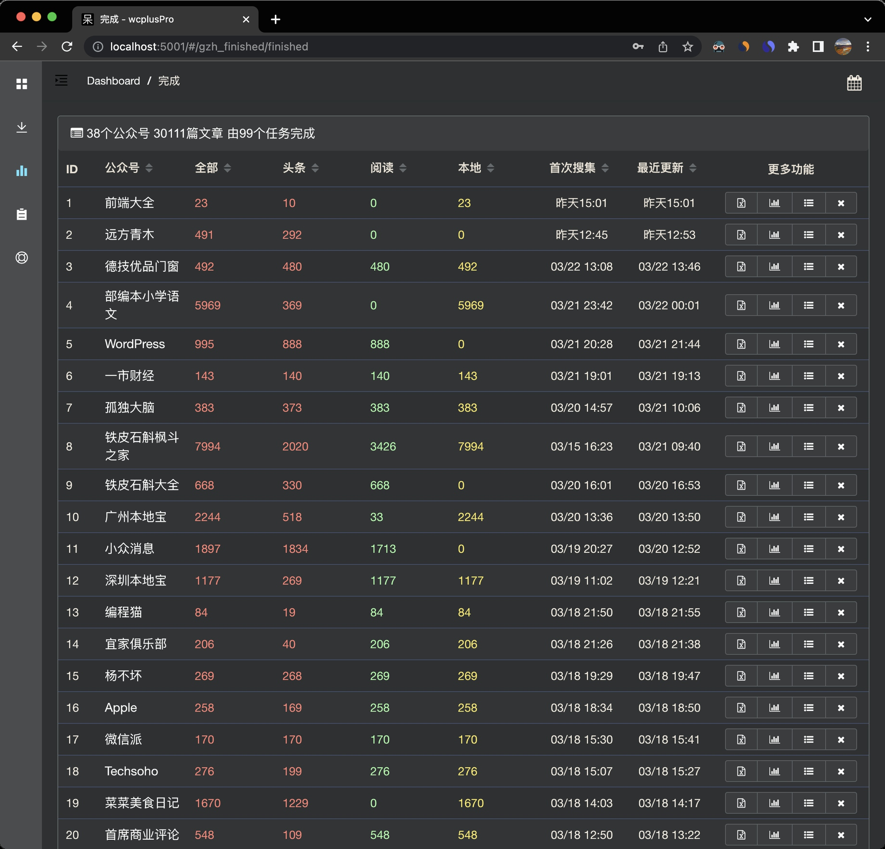

在表1中，一个公众号就是一行。每一行显示着公众号的：

1. 昵称
2. 文章总数
3. 有阅读数据的文章总数
4. 头条文章数
5. 原文保存在本地的文章数
6. 首次搜集时间
7. 最近搜集时间

点击表格标题可按照该列对所有的公众号进行排序，比如按照文章数量排序，重复点击可以在升序、降序之间来回切换。

#### 表2 公众号的全部文章

点击表1 的公众号昵称，即可在下方打开表2，一一显示该公众号的所有文章。

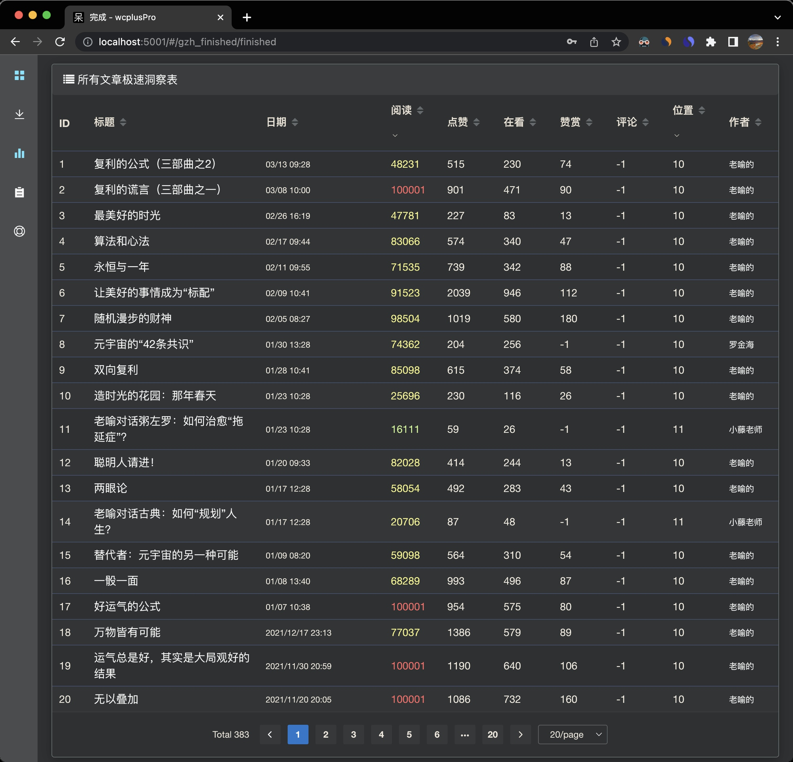

在表2 中，一行就是一篇文章。每一行显示该文章的：

1. 发文日期，精确到分钟
2. 阅读量
3. 在看量
4. 评论量
5. 文章位置
6. 作者
7. 标题
8. 查看本地保存的原文（创建任务时如果选中保存原文，之后文章被删除或者公众号注销后仍然可以查看）

同样的，点击表格标题可以对文章进行排序。除此之外，点击文章标题可在新的浏览器标签打开文章具体内容，点击位置标题旁的小箭头可筛选出不同位置的文章。

#### 表3 阅读数据全景图

在表1 的最后一列"更多功能"中，点击左3按钮，即可在表1上方打开表3。表3 是一张柱状图，以日期为x轴，各种阅读数据为y轴，以不同的颜色单独或组合显示每一篇头条文章的阅读数据。

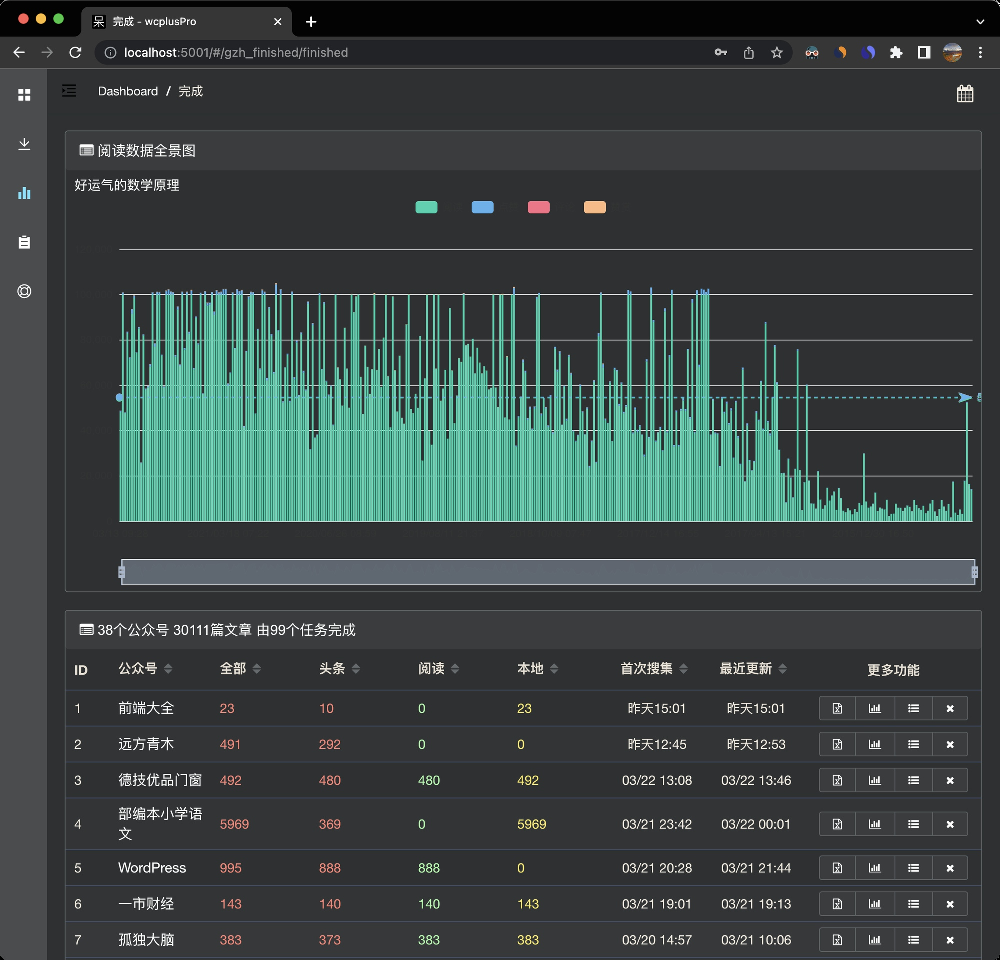

每个公众号都有一张自己的历史阅读数据柱状图，它是可交互式的：

1. x轴左边为现在，右边为过去，按发文时间排序。从过去到现在，公众号的影响力变化一目了然
2. 可显示阅读、在看、打赏、评论在内的阅读数据
3. 点击表格上方色块，可激活、隐藏相关阅读数据
4. 鼠标悬停在柱状区可使用滚轮缩放x轴日期
5. 鼠标掠过相应数据柱，左上角显示该文章标题
6. 鼠标点击相应数据柱，可在新的浏览器标签打开文章
7. 底部使用显示全局数据走势，点按鼠标拖动可指定选区缩放x轴

阅读数据全景图支持矢量放大，点击条柱可打开文章原文

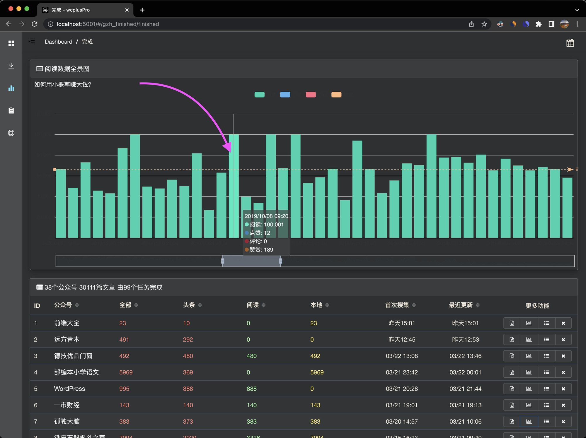

结合表2、表3，查看文章内容有两种方法：

1. 点击表2的标题，用严谨的排序、筛选方式，审视每一篇文章。
2. 点击表3的数据柱，用一眼望去的感性，挑选峰、谷、涨、跌等特殊文章。

#### 表4 公众号报告

一个用心经营、赚到钱、收获到价值的公众号，是主理人的一路修行。除了依靠人的智力和记忆力，一篇篇文章挖掘之外，wcplusPro 总希望自己能做点事情。面向公众号的报告，是 wcplusPro 在持续探索的领域。

2022 年 2 月，wcplusPro 正式加入报告模块，此后的升级大多将围绕数据分析和智能化报告上。

在表1 中，点击公众号所在行"更多功能"右二按钮，即可进入该公众号的报告页。

当前，报告模块提供了如下功能

1. 发文周历
2. 阅读量历史曲线图
3. 点赞量历史曲线图
4. 在看量历史曲线图
5. 所有阅读量10万+ 
6. 计算在看/点赞 比
7. 计算打赏/在看 比

上述数据中，发文周历可能需要进一步解释。请看下图1顶部的发文周历模块（单击可放大）：

一个小方格表示一天，一列共7格表示一个星期，第一行表示周日最后一行表示周六。共有大约365个方格，有蓝色表示该公众号当天有发文，当天发文数量越多，蓝色越深。

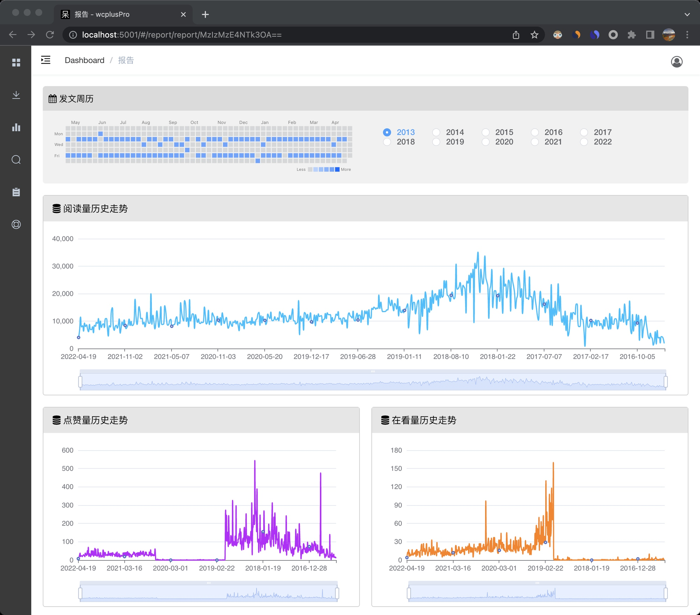
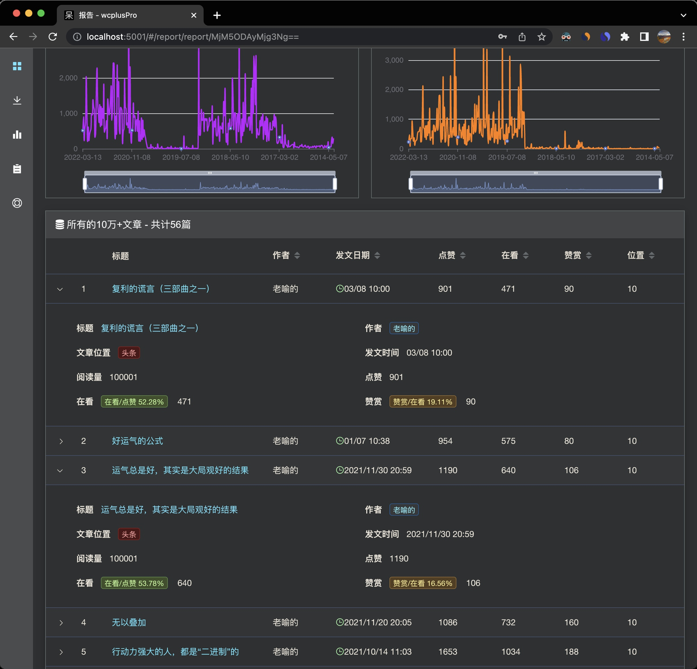

### 第三 精确搜索

在 wcplusPro 的帮助下，一个用户搜集近千个公众号的全部历史文章完全不是问题，假如平均每个公众号发文 1000 篇，1000 个公众号也会积累 100 万篇文章。数量如此之多，搜索是不可或缺的功能，具体来说 wcplusPro 的搜索有如下特点：

1. 搜索对象为已经采集的全部文章
2. 可完全匹配文章标题、摘要、作者中的关键词
3. 可对搜索结果按照发文时间、阅读量、点赞量、在看量、评论量、赞赏量、作者进行排序
4. 排序支持升序和降序
5. 针对搜索结果，提供月度指数，将每月的结果数量绘制成条形图。

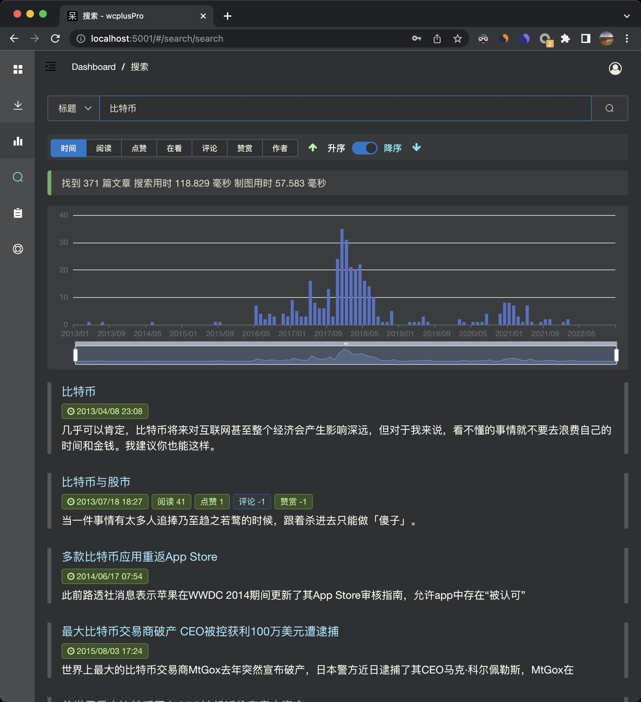
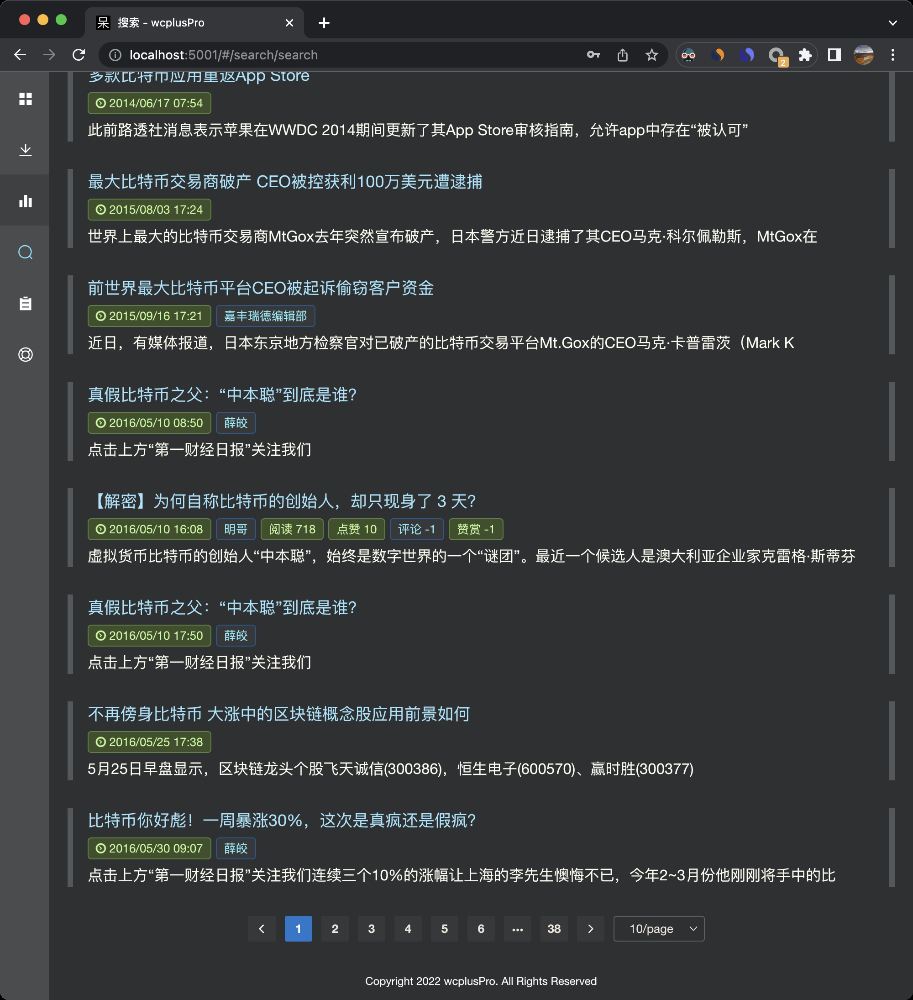

### 第四 数据导出

wcplusPro 支持如下形式的数据导出：

1. 单个公众号的文章导出为 Excel 格式（不包括文章内容）
2. 单个公众号的文章内容导出为离线网页格式，一篇文章一个网页文件

导出功能入口在表1 的更多功能列，收藏夹列表的操作列。
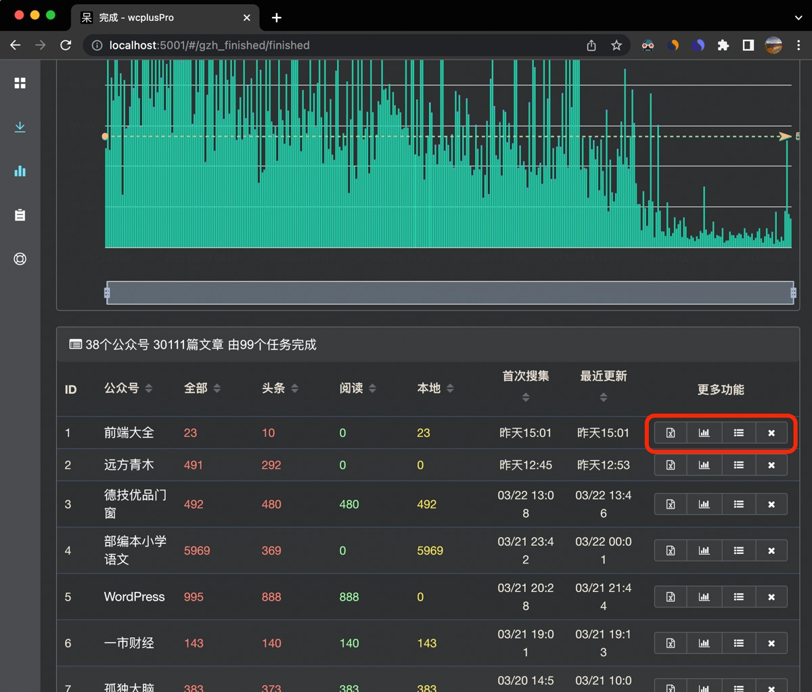

数据导出之后，可直接使用 Excel、Numbers 打开和编辑
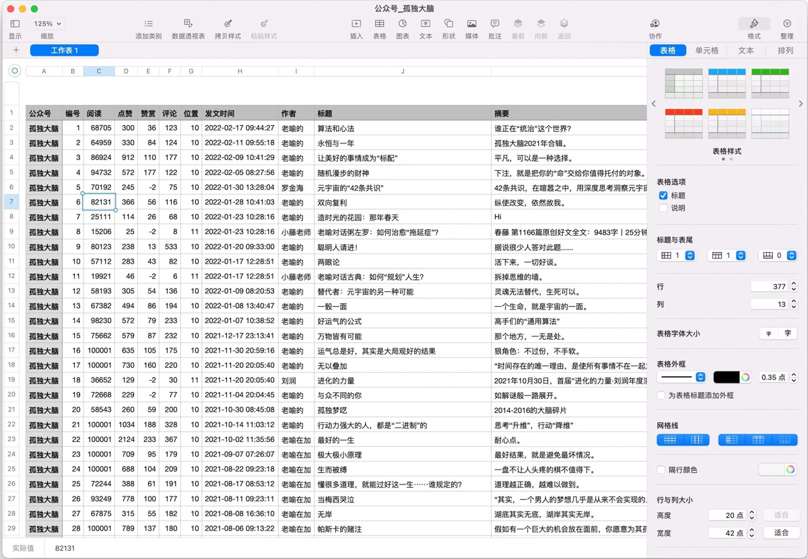

当然，你也可以进一步制作图表，用在幻灯片或者行业报告中展示

### 第五 其他问题

#### Q: wcplusPro 对电脑要求高吗？支持哪些操作系统？
wcplusPro 对电脑要求并不高，普通办公电脑即可流程运行。得益于 Python 跨平台的特性，wcplusPro 支持所有平台操作系统，比如windows7、10、11，macos，Linux的各种发行版（包括树莓派）。

**注意: wcplusPro 需要一台iPhone或者iPad配合使用，否者无法搜集数据** 

#### Q: 使用起来简单吗？
wcplusPro 的前身是 weixin_crawler，从2018年末起，软件经过多年的优化，一键安装、一键运行，对用户无任何技术要求。
另外，我们为 wcplusPro 用户提供至少一次的免费远程协助服务，帮助用户快速上手。

#### Q: 订阅制还是买断制？
wcplusPro 同时支持买断制和订阅制，买断制提供源代码（限量交付100套），订阅制提供加密文件和授权证书，详见[产品和交付](http://www.wcplus.cn/product?s=weixin_crawler)

#### Q: 后续升级免费吗？
免费升级

#### Q: 如何购买？售价多少？是否可以开具发票？
wcplusPro 的价格会有阶段性的调整，实时价格请邮件咨询 wonderfulsuccess@163.com，你也可在[官网底部](http://www.wcplus.cn/?s=weixin_crawler)找到客服微信。
可开具电子发票，开票内容为 信息技术服务/其他软件服务

### 第六 视频介绍

[跳转到 B站 查看高清视频介绍](https://www.bilibili.com/video/BV1Ji4y1S7Xy)

### 第七 在线演示

[建议使用电脑打开 http://www.wcplus.cn/demo](http://www.wcplus.cn/demo?s=weixin_crawler) 

**注意**：在线演示是以 wcplusPro7.2 为原型上线的，并非最新版，部分功能可能缺失。如果你需要详细了解全部功能，请观看[10 分钟的介绍视频](https://www.bilibili.com/video/BV1Ji4y1S7Xy)，欢迎微信联系我们详细咨询。

当前的最新版本和发布时间可在 [在线演示的帮助页面](http://www.wcplus.cn/demo#/help/help) 点击"检查更新"查看。

## 😊 版本升级记录

#### 7.41 2022年6月9日
1. 源码版支持 Python3.7.7 及更高版本，更低版本未做严格测试

#### 7.4 2022年6月8日
1. 新增订阅版，可按时长购买 wcplusPro

#### 7.3 2022年5月31日
1. 新增搜集发文地区, 可在全部历史文章列表日期和地区栏查看

#### 7.2 2022年4月17日
1. 新增历史任务日历热点图
2. 阅读数据全景图增加在看数据
3. 公众号报告增加发文日历热点图

#### 7.1 2022年4月13日
1. 新增搜索功能，可按照标题、摘要、作者 关键词精确搜索'
2. 新增搜索结果多种排序方式
3. 新增搜索结果月份指数

#### 7.05 2022年4月4日
1. 添加导出到 Excel 的功能
2. 修复运行 windows_install_package.bat 闪退的 bug
3. 修复搜集阅读量为 0 文章的阅读数据时，提示 out of date 的错误

#### 7.04 2022年3月27日
1. 增加更新检查功能

#### 7.03 2022年3月25日
1. 修复已知 bug

#### 7.03 2022年3月24日
1. 修复 windows 下保存文章原文失败的错误

#### 7.01 2022年3月22日
1. 简化安装和使用步骤，双击鼠标即可完成所有工作
2. 增加 window 系统双击安装Python依赖脚本
3. 增加 window 系统双击安装运行wcplusPro脚本
4. 增加 macos 双击安装Python依赖脚本
5. 增加 macos 双击安装运行wcplusPro脚本

#### 7.0 2022年3月21日
1. 使用协程重写了全部后端，所有网络请求均为异步模式，增强了代码可维护性，二次开发成本更低'
2. 数据库从 mysql 改为 sqlite，使用无需单独运行数据库，降低了对系统资源的占用
3. 重新设计了任务板块 UI，创建任务、任务状态、任务进度、参数、历史任务一目了然
4. 增加数据搜集过程实时推送用户界面的功能，无需要在终端观察任务进度
5. 增加历史任务管理功能，完整记录所有的历史任务
6. 优化了公众历史文章列表，浏览文章数量超过 5000 的公众号更加流畅
7. 增加了配套网站 wcplus.cn 提供在线文档在内的多种功能'
8. 增加检查更新功能

#### 6.62 2022年2月25日
1. 公众号报告增加所有阅读量10万+文章专栏
2. 增加文章 在看/点赞比、赞赏/在看比

#### 6.61 2022年2月20日
1. 修复已知 bug

#### 6.6 2022年2月19日
1. 新增公众号报告 统计阅读量、点赞、在看数据历史变化趋势
2. 升级前端工程 运行前端项目更加简单
3. 修复无法通过 qq.com 跳转到公众号主页的错误
4. 新增管理登陆功能

#### 6.31 2022年1月7日
1. 修改代理服务器仅对微信和微信读书有效
2. 移除代理服务器无关日志信息

#### 6.3 2021年11月10日
1. 修复macOS Monterey 隔空播放占用 5000 端口的冲突

#### 6.23 2021年10月20日
1. 修复已知 bug

#### 6.22 2021年9月20日
1. 修复通过微信读书采集阅读数据提示 keyError subscene 的错误'
2. 修复其他已知 bug'