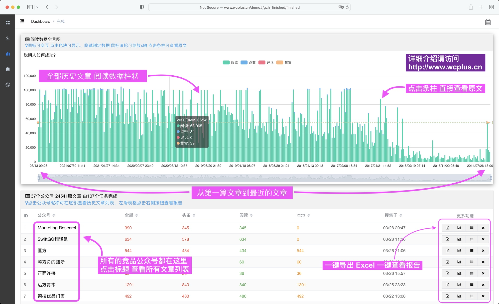

Hi weixin_crawler 已经不再开源, 我们推出了产品级微信公众号数据分析软件 wcplusPro，它具有这些特点：

- 前后端分离，前端使用 Vue2，后端使用 Python3.7+
- 同时使用 http request api 和 socketio 进行前后端通信
- Web 框架使用 tornado，同时爬虫异步网络请求也是 tornado
- 使用 Python 协程提高采集速度
- 使用轻量级数据库 sqlite，得益于 Python 对 sqlite 的原生支持，可免安装直接运行。尽管如此，仍然可以高效存取百万数量级文章
- 提供一键安装Python依赖脚本，提供一键启动脚本，技术小白也能轻松使用

wcplusPro 致力于帮助你从微信公众号中获得洞见，背后的原理并不复杂：

- 首先，wcplusPro 提供稳定的公众号数据搜集服务，帮助你拿到任何公众号的全部历史文章数据，包括阅读数据。
- 其次，以公众号为单位，wcplusPro 提供多种上帝视角图表报告和精确搜索服务，你甚至可以导出数据。
- 最后，wcplusPro 针对桌面电脑优化，充分利用大屏幕，高密度陈列信息。一台电脑运行 wcplusPro，局域网内的所有设备都能使用。

### 目录

[[toc]]

### wcplusPro

本文为图文介绍，如果你想通过几分钟的视频快速了解，请观看 [视频介绍](https://www.bilibili.com/video/BV12P4y1T7CJ)

你还可通过[在线演示](/demo)快速体验 wcplusPro 提供的部分功能。鉴于 wcplusPro 是专为大尺寸屏幕设计的高效公众号数据分析软件，建议使用电脑查看在线演示 [http://www.wcplus.cn/demo](/demo) 。

当你打开 wcplusPro，在启动页赫然显示着两个硕大的数字

- 左上角的数字，表示系统中有 73 个微信公众号；
- 右上角的数字，表示该用户创建了 153 个数据采集任务；通过下方的任务周历，可以清晰看到任务创建的日期、星期和当日相对数量；
- 下面的数字，表示系统中有 11万9千多篇文章；

尽管多达 10 万篇文章， wcplusPro 依然将所有的数据管理得井井有条。用起来起来健步如飞，长期后台运行也不会导致电脑发热、卡顿。

对于绝大多数人而言，不管是出于何种目的，一一研究 100 个公众号的 10 万篇文章，应该是一个绰绰有余的上限，虽然  wcplusPro 搜集公众号数据的能力不止于此。

你可能想问，wcplusPro 具体能搜集到关于公众号的哪些数据？提供了什么样的工具帮助用户使用这些数据？

在正式介绍 wcplusPro 之前，简单总结下公众号这种信息传播途径的特点。

### 公众号的特点

公众号是个人、媒体、自媒体、企业、组织机构，对外发布消息的渠道。通常会围绕具体话题、行业、产品等，展开描述。正因为发布公众号文章的门槛低，各种信号和噪音混杂其中。

一个公众号就像是一个博客，每隔一段时间，就会发布一些新文章。日积月累，这个博客会积累成千上万篇文章。这些文章是按照时间这个单一维度，堆叠在一个很深的栈之中，遵循先进后出的原则。

一个普通的微信用户，少则订阅数十个公众号，多则订阅上千个。所有的公众号都被放在一个会话夹，顶部显示的永远是最近有更新的公众号消息。

如此，用户关注的公众号越多，获取信息的效率就越低。最后，甚至不看公众号了或者完全交给随机性。

有些公众号掐着用户起床蹲马桶、睡前刷手机的时间推文，无非就是要抢占用户打开微信的第一注意力，将自己的内容呈现在用户视野之中。

今天的消息就会淹没昨天的消息，最新更新的公众号就会覆盖之前更新的公众号。加之公众号手机阅读的形式，一块手机屏幕的视野有限，人是没有办法随意在这条历史中随意截取信息的。

你有自己特别喜欢的公众号吗？你是否还记得这个公众号上个月给出过哪些观点？零碎的信息只有连接成网才能产生价值，wcplusPro 本质上不是数据采集软件，而是提高用户从公众号获取信息效率的工具。

提高效率是目标，如何才能实现目标？从务实的角度出发，有些基本的动作做到了，效率也就提高了一大截，比如：更大的屏幕、更高密度的信息陈列、更直观的数据展示、更快捷的文章节点穿梭。这些，都有可能让用户从公众号中获得更加有效的信息。

### 第一 搜集数据

#### 1 可搜集内容

任意一个公众号发布的每一篇文章，wcplusPro 都能做到自动保存。对于那些已经被删除或屏蔽的文章，也就是手机微信也无法查看的文章，wcplusPro 自然也无能为力。另外，对于已经注销的公众号，也无法搜集其文章数据。

具体到一篇文章上，wcplusPro 能搜集的数据包括：

1. 所属公众号
2. 标题
3. 作者
4. 摘要
5. 发布时间（精确到秒）
6. 文章位置（头条、次1条等）
7. 永久文章链接
8. 图文内容（包括于开头的原创标识和文末的原文链接，用户可进一步提取图文中的文字和图片）
9. 阅读量、点赞量、在看量、评论量、打赏量

在内的数据。

#### 2 效率

在上述 9 条可搜集数据中，前 8 条相对较快， 可达到 15篇文章/秒 的速度。第 9 条数据单独搜集，速度为 1篇文章/3秒。

举个例子，对于一个历史发文 3000 篇的公众号，完成前 8 类数据的搜集需要  7 分钟。继续完成第 9 类数据的搜集需要额外  150 分钟，如果只要头条文章的阅读数据，时间可缩短至 30 分钟左右。

从我们的经验来看，除了资讯类大号，发文总数超过 3000 篇的高质量公众号并不多。绝大多数情况下，30 分钟左右即可完成对一个公众号全部数据的搜集。如果排除第 9 类数据，时间可缩短至 5 分钟。

#### 3 搜集任务管理

一个任务描述了要搜集一个公众号的哪些数据，比如是否需要阅读量，是否需要文章内容。

在 wcplusPro 中，任务进度实时推送到用户界面，搜集了多少、还剩多少、剩余时间估算，一目了然。

另外，wcplusPro 的用户界面是通过浏览器呈现，一旦 wcplusPro 运行在了一台电脑上，同一个网络下的其他设备（包括手机和平板）或者用户都能使用，类似共享的打印机。下图是 wcplusPro 在移动端的 UI。

### 第二 洞察数据

wcplusPro 的价值在于对于公众号数据的重新展示、排列、筛选。让用户针对公众号进行主题阅读时，可快速穿梭于不同的公众号、文章之间，提数倍效率的同时，让获得洞见的几率大幅度提高。

这一切和 wcplusPro 提供的这几张数据表格分不开。

#### 表1 所有已经搜集到的公众号

在表1中，一个公众号就是一行。每一行显示着公众号的：

1. 昵称
2. 文章总数
3. 有阅读数据的文章总数
4. 头条文章数
5. 原文保存在本地的文章数
6. 首次搜集时间
7. 最近搜集时间

点击表格标题可按照该列对所有的公众号进行排序，比如按照文章数量排序，重复点击可以在升序、降序之间来回切换。

#### 表2 公众号的全部文章

点击表1 的公众号昵称，即可在下方打开表2，一一显示该公众号的所有文章。

在表2 中，一行就是一篇文章。每一行显示该文章的：

1. 发文日期，精确到分钟
2. 阅读量
3. 在看量
4. 评论量
5. 文章位置
6. 作者
7. 标题
8. 查看本地保存的原文（创建任务时如果选中保存原文，之后文章被删除或者公众号注销后仍然可以查看）

同样的，点击表格标题可以对文章进行排序。除此之外，点击文章标题可在新的浏览器标签打开文章具体内容，点击位置标题旁的小箭头可筛选出不同位置的文章。

#### 表3 阅读数据全景图

在表1 的最后一列"更多功能"中，点击左3按钮，即可在表1上方打开表3。表3 是一张柱状图，以日期为x轴，各种阅读数据为y轴，以不同的颜色单独或组合显示每一篇头条文章的阅读数据。

每个公众号都有一张自己的历史阅读数据柱状图，它是可交互式的：

1. x轴左边为现在，右边为过去，按发文时间排序。从过去到现在，公众号的影响力变化一目了然
2. 可显示阅读、在看、打赏、评论在内的阅读数据
3. 点击表格上方色块，可激活、隐藏相关阅读数据
4. 鼠标悬停在柱状区可使用滚轮缩放x轴日期
5. 鼠标掠过相应数据柱，左上角显示该文章标题
6. 鼠标点击相应数据柱，可在新的浏览器标签打开文章
7. 底部使用显示全局数据走势，点按鼠标拖动可指定选区缩放x轴

阅读数据全景图支持矢量放大，点击条柱可打开文章原文

结合表2、表3，查看文章内容有两种方法：

1. 点击表2的标题，用严谨的排序、筛选方式，审视每一篇文章。
2. 点击表3的数据柱，用一眼望去的感性，挑选峰、谷、涨、跌等特殊文章。

#### 表4 公众号报告

一个用心经营、赚到钱、收获到价值的公众号，是主理人的一路修行。除了依靠人的智力和记忆力，一篇篇文章挖掘之外，wcplusPro 总希望自己能做点事情。面向公众号的报告，是 wcplusPro 在持续探索的领域。

2022 年 2 月，wcplusPro 正式加入报告模块，此后的升级大多将围绕数据分析和智能化报告上。

在表1 中，点击公众号所在行"更多功能"右二按钮，即可进入该公众号的报告页。

当前，报告模块提供了如下功能

1. 发文周历
2. 阅读量历史曲线图
3. 点赞量历史曲线图
4. 在看量历史曲线图
5. 所有阅读量10万+ 
6. 计算在看/点赞 比
7. 计算打赏/在看 比

上述数据中，发文周历可能需要进一步解释。请看下图1顶部的发文周历模块（单击可放大）：

一个小方格表示一天，一列共7格表示一个星期，第一行表示周日最后一行表示周六。共有大约365个方格，有蓝色表示该公众号当天有发文，当天发文数量越多，蓝色越深。

### 第三 精确搜索

在 wcplusPro 的帮助下，一个用户搜集近千个公众号的全部历史文章完全不是问题，假如平均每个公众号发文 1000 篇，1000 个公众号也会积累 100 万篇文章。数量如此之多，搜索是不可或缺的功能，具体来说 wcplusPro 的搜索有如下特点：

1. 搜索对象为已经采集的全部文章
2. 可完全匹配文章标题、摘要、作者中的关键词
3. 可对搜索结果按照发文时间、阅读量、点赞量、在看量、评论量、赞赏量、作者进行排序
4. 排序支持升序和降序
5. 针对搜索结果，提供月度指数，将每月的结果数量绘制成条形图。

### 第四 数据导出

wcplusPro 支持如下形式的数据导出：

1. 单个公众号的文章导出为 Excel 格式（不包括文章内容）
2. 单个公众号的文章内容导出为离线网页格式，一篇文章一个网页文件

导出功能入口在表1 的更多功能列，收藏夹列表的操作列。

数据导出之后，可直接使用 Excel、Numbers 打开和编辑

当然，你也可以进一步制作图表，用在幻灯片或者行业报告中展示

### 第五 其他问题

#### Q: wcplusPro 对电脑要求高吗？支持苹果电脑吗？
wcplusPro 对电脑要求可以说是偏低，一半办公电脑即可流程运行。wcplusPro 支持所有平台操作系统，比如windows7、10、11，macos，Linux的各种发行版。

**注意: wcplusPro 需要一台iPhone或者iPad配合使用，否者无法搜集数据** 

#### Q: 使用起来简单吗？
wcplusPro 的前身是微搜，从2018年末起，软件经过多年的优化和文档迭代。即便是电脑小白，也能轻松使用。

另外，我们为 wcplusPro 用户提供至少一次的免费远程协助服务，帮助用户快速上手。

#### Q: 订阅制还是买断制？
wcplusPro 目前是买断制并且开放源代码供用户学习研究，一次购买可长期使用。

#### Q: 后续升级免费吗？
免费升级

#### Q: 如何购买？售价多少？是否可以开具发票？
wcplusPro 的价格会有阶段性的调整，实时价格请微信咨询 *wonderfulcorporation* 可备注 wcplusPro，增加通过率。
可开具电子发票，开票内容为 信息技术服务/其他软件服务

### 第六 视频介绍

[跳转到 B站 查看高清视频介绍](https://www.bilibili.com/video/BV1Ji4y1S7Xy)

### 第七 在线演示

[建议使用电脑打开 http://www.wcplus.cn/demo](/demo) 

**注意**：在线演示是以 wcplusPro7.04 为原型上线的，截止到2022年4月29日，已经升级到了 7.2，期间新增了任务周历、发文周历、精确搜索等功能，在线演示均无。如果你需要详细了解功能，请观看[10 分钟的介绍视频](https://www.bilibili.com/video/BV1Ji4y1S7Xy)。

当前的最新版本和发布时间可在 [Demo的帮助页面](http://www.wcplus.cn/demo#/help/help) 点击检查更新查看。

### 第八 免责声明

wcplusPro 旨在提高用户的公众号数据分析技能，通过 wcplusPro 搜集数据的速度不应该高于人工手动输入的速度。搜集数据的过程中，用户需要严格遵循对方服务器 robots.txt 协议。

用户使用 wcplusPro 即视为无条件同意并遵循上诉条款，由此产生的任何法律问题由用户自行承担，与 wcplusPro 及其开发者无关。

[返回首页](/)